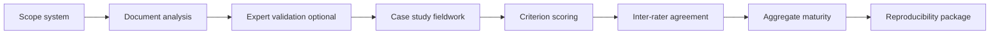

> **Status: LEGACY — v0.1.0**  
> This document describes the historical Governance Readiness Benchmark / v0.1 instrument design.  
> It is retained for provenance and is **not** the active analytical framework.  
> **Active framework:** Disclosure Functions v1 — see [`localgovbench_measurement_validation/affordance/README.md`](../localgovbench_measurement_validation/affordance/README.md) and the root [`README.md`](../README.md).

# Methodology

This document describes how the Local AI Governance Framework (v0.1) may be used in **research studies** on local and on-premise LLM governance in European public sector organizations.

> **Status:** The repository currently provides the instrument, synthetic examples, and reproducibility tooling. **Empirical datasets and validated psychometric properties are not yet included.**

## Research objective

The intended programme is to:

1. Characterize governance practices around on-premise LLM deployments in public bodies.
2. Examine how documented practices relate to regulatory themes (see [ai_act_mapping.md](ai_act_mapping.md) and [gdpr_mapping.md](gdpr_mapping.md)) in an indicative, non-legal sense.
3. Produce a reproducible benchmark artefact suitable for archival release (Zenodo) after field work.

The framework is a **structured coding instrument**, not a certified compliance tool.

---

## 1. Document analysis

Document analysis can be used to gather **evidence of practice** before or alongside interviews.

| Step | Description |
|------|-------------|
| Scope | Define the AI system boundary (on-prem LLM, integrations, data flows). |
| Corpus | Collect policies, architecture diagrams, contracts, RoPA excerpts, risk registers, runbooks (with consent and redaction). |
| Code | Map excerpts to framework criteria (`{dimension_id}_{criterion_id}`) using the checklist in `localgovbench/framework/checklist.py`. |
| Score | Assign maturity 0–4 per criterion with an evidence log (document ID, page, date). |
| Audit trail | Store coding decisions outside the public repo if documents are sensitive; publish only anonymized derivatives. |

**Synthetic pilot:** Use `examples/example_assessment.yaml` to test coding templates before applying them to real corpora.

---

## 2. Expert validation

Expert validation can assess **face and content validity** of the v0.1 instrument before field deployment.

| Step | Description |
|------|-------------|
| Panel | Recruit interdisciplinary experts (public administration, law, IT security, data protection). |
| Review | Experts rate clarity and relevance of each criterion; flag gaps or overlap. |
| Revision | Record protocol version when criteria or wording change. |
| Reporting | Publish a short validation memo (separate from this repo until approved for release). |

This step does **not** by itself establish legal compliance or predictive validity.

---

## 3. Public sector case studies

Case studies can apply the framework in **embedded settings** (municipalities, regions, agencies).

| Step | Description |
|------|-------------|
| Selection | Define inclusion criteria (e.g., operational on-prem LLM, minimum documentation availability). |
| Ethics | Obtain institutional ethics approval and data processing agreements. |
| Data collection | Combine document analysis, interviews, and optional demonstrations. |
| Within-case analysis | Score maturity per criterion; narrate strengths and gaps with cited evidence. |
| Cross-case analysis | Compare dimension profiles; avoid ranking organizations without consent and context. |

Case study materials with personal or identifiable data **must not** be committed to this repository.

---

## 4. Maturity scoring

Maturity scoring uses the v0.1 scale implemented in `localgovbench/framework/scoring.py`:

| Level | Label |
|-------|-------|
| 0 | Absent |
| 1 | Ad hoc |
| 2 | Partially defined |
| 3 | Managed |
| 4 | Optimized |

| Practice | Guidance |
|----------|----------|
| Unit of analysis | One score per checklist item (criterion). |
| Aggregation | Dimension score = mean of criterion scores; overall = weighted mean (uniform weights in v0.1). |
| Evidence | Each score should reference at least one evidence type or explicit absence. |
| Tooling | `compute_maturity_score(responses)`; validate YAML with `localgovbench.evaluation.validators`. |

Scores describe **observed governance maturity** in the study protocol; they are not legal compliance indices.

---

## 5. Inter-rater agreement

When multiple coders score the same case, report inter-rater agreement transparently.

| Step | Description |
|------|-------------|
| Training | Joint coding of 1–2 synthetic or pilot cases using `examples/example_assessment.yaml`. |
| Independent coding | Coders score blinded or independently with shared codebook. |
| Agreement | Compute Cohen's κ or Krippendorff's α per criterion or dimension (study-specific choice). |
| Adjudication | Resolve discrepancies above a pre-specified threshold via discussion or third rater. |
| Report | Publish codebook version, κ/α tables, and adjudication rules in supplementary materials. |

Inter-rater statistics are **planned** for empirical releases; they are not bundled in v0.1.

---

## 6. Reproducibility package

A reproducibility package supports independent verification of the **computational** parts of a study.

| Component | Location / action |
|-----------|-------------------|
| Environment | Python 3.11+; `pip install -e ".[dev]"` |
| Tests | `pytest` (framework logic) |
| Structure check | `python scripts/validate_repository.py` |
| Example pipeline | `python scripts/run_example_assessment.py` |
| Version pin | Git tag (e.g. `v0.1.0`) matching `CITATION.cff` and Zenodo archive |
| Archive | Zenodo DOI; store archive checksum (see [zenodo_release.md](zenodo_release.md)) |
| Data | Publish only synthetic or anonymized datasets with `metadata.synthetic` flags |

Researchers should cite the **exact Zenodo version** used in analysis, not only the moving `main` branch.

---

## Assessment workflow (overview)

## Data policy (this repository)

| Stage | Status in current release |
|-------|---------------------------|
| Synthetic examples | `examples/` |
| Template instruments | `data/templates/` (placeholders) |
| Raw field data | Not included — `data/raw/` empty |
| Processed results | Not included — `data/processed/` empty |

> **Warning:** Demonstration scripts use **synthetic** inputs unless a release note states otherwise.

## Ethics

Empirical work should follow institutional ethics review, lawful basis for processing, data minimization, and transparency obligations applicable to the public body. Do not commit identifiable records, manuscript drafts, or reviewer correspondence to this repository.
